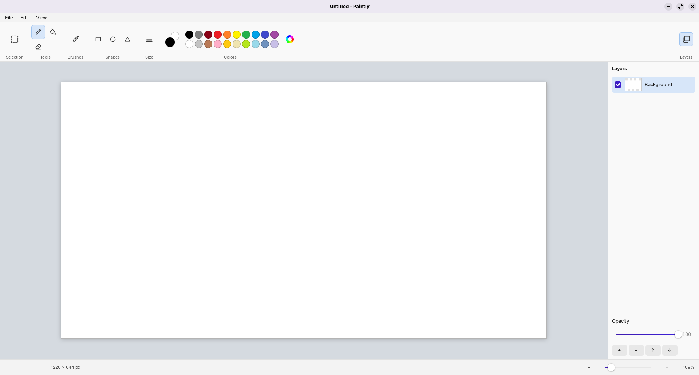

# Paintly

A fast, simple, native Linux painting app, inspired by Paint from Windows 11.

Raster based painting app with some image manipulation tools, designed to be simple and get the job done!




## Features

- **Elegant Interface**: A modern interface that gets out of your way and gets the job done in an instant.
- **Tools**: Features standard raster tools - Pencil, Brush, Eraser, Fill bucket, Simple Shapes.\
  All built on a single easily extendable Tool interface - More to come!
- **Colors**: Dual Selector (left/right mouse button), a
  20-swatch color palette, and the color chooser with alpha.
- **Layers**: add / delete / reorder / hide, per-layer opacity, live thumbnails.
- **Simple layout**: A simple & structured layout. Ribbon Groups, Centered Canvas, status bar with zoom control.
- **UX**: Undo History, PNG support, and keyboard shortcuts.

## Design principles

1. **Instant:** Nothing happens before the window appears: no splash, no loading. Start and get it done quick!
2. **Simple:** No scouring through dense menus, no trying to understand complex tools. Simple yet effective.
4. **Effective:** Gets the job done. All tools are available in simple menus. 
3. **Performance:** GTK4 composites the finished frame on the GPU, so big canvases stay smooth \
Drawing logic remains on CPU for simplicity.


## Quick start

```sh
# Debian / Ubuntu / Zorin / Mint
sudo apt install build-essential libgtk-4-dev

make          # -> build/paintly
make run
```

## Documentation
Coming Soon™

## Development Principles

1. **Simplicity:** Keep it easy to understand and develop.
2. **Boring, explicit C.** If you can read C, you can read all of Paintly in an evening.\
No globals,
   no macros magic, no code generation beyond GTK's standard resource
   bundling.
3. **Documentation & Comments:** Comments are not meant to be paragraphs long.\
Keep the lengthy thoughts in documentation references.

## Disclaimer

Paintly is an independent application and is not affiliated with or endorsed by Microsoft Corporation.\
Windows and Paint are trademarks of Microsoft Corporation.\
Any use of trade names or trademarks is for identification purposes only.